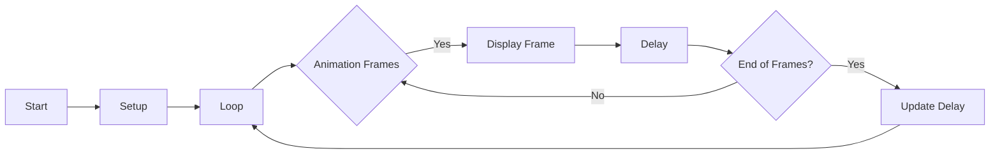

# Animation Display Code

This code serves as an example of how to create an animation display using an Arduino board and an SSD1306 OLED display. It demonstrates the process of showing a series of frames as a continuous animation on the display.

## Dependencies

The code relies on the following libraries:

- Wire.h: This library facilitates I2C communication with the SSD1306 display.
- Adafruit_GFX.h: It provides graphics functions for drawing on the display.
- Adafruit_SSD1306.h: This library offers specific functions for controlling the SSD1306 OLED display.

Ensure that you have installed these libraries before executing the code.

## Hardware Setup

To utilize this code, you will need the following hardware components:

- Arduino board
- SSD1306 OLED display

Connect the SSD1306 display to the Arduino board using the I2C interface. Refer to the datasheet or documentation of your specific display for pin connection details.

## Code Explanation

The code begins by defining the screen dimensions and creating an instance of the `Adafruit_SSD1306` class, which is responsible for controlling the display.

Next, a series of frames are defined as arrays of unsigned char data. Each frame represents a single animation frame and is stored in program memory (PROGMEM) to conserve RAM.

In the `setup()` function, the code initializes the SSD1306 display and verifies if the allocation was successful. If the allocation fails, the code enters an infinite loop.

In the `loop()` function, the animation frames are displayed sequentially on the OLED display. Each frame is drawn using the `drawBitmap()` function provided by the `Adafruit_SSD1306` library. After drawing the frame, the display is updated using the `display()` function, and a delay is introduced to control the animation speed.

The animation cycles through all the frames repeatedly, gradually decreasing the delay between frames until it reaches a minimum value of 50 milliseconds.

## Flowchart

## Usage

To utilize this code, follow these steps:

1. Set up the Arduino board and connect the SSD1306 display.
2. Install the required libraries (Wire, Adafruit_GFX, Adafruit_SSD1306) in your Arduino IDE.
3. Copy the code into a new sketch in your Arduino IDE.
4. Upload the sketch to your Arduino board.
5. Observe the animation displayed on the SSD1306 OLED display.

You can adjust the `frame_delay` variable to control the speed of the animation. Higher values result in a slower animation, while lower values make it faster. Experiment with different delay values to achieve the desired animation speed.

Remember to refer to the documentation of your specific SSD1306 display for any additional setup or configuration steps that may be required.

## Troubleshooting

- If the SSD1306 allocation fails during setup, ensure that the display is properly connected to the Arduino board and that the correct I2C address is used in the `begin()` function call.

- If the animation is not displayed or appears distorted, check the connections between the Arduino and the SSD1306 display. Verify that the pins are correctly wired and that the display is receiving power.

- If you encounter any issues, refer to the documentation and examples provided with the libraries used in the code. Additionally, consult online forums and resources for troubleshooting specific problems related to your setup.
