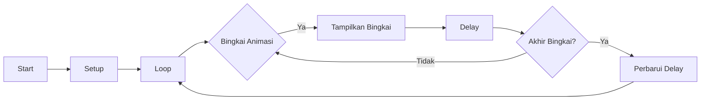

# Kode Tampilan Animasi

Kode ini adalah contoh tampilan animasi menggunakan papan Arduino dan tampilan OLED SSD1306. Ini menunjukkan bagaimana menampilkan serangkaian bingkai sebagai animasi kontinu pada tampilan.

## Dependencies

Kode ini bergantung pada library berikut:

- Wire.h: Library ini digunakan untuk komunikasi I2C dengan tampilan SSD1306.
- Adafruit_GFX.h: Library ini menyediakan fungsi grafis untuk menggambar pada tampilan.
- Adafruit_SSD1306.h: Library ini menyediakan fungsi khusus untuk mengontrol tampilan OLED SSD1306.

Pastikan untuk menginstal library-library ini sebelum menjalankan kode.

## Pengaturan Perangkat Keras

Untuk menggunakan kode ini, Anda membutuhkan komponen perangkat keras berikut:

- Papan Arduino
- Tampilan OLED SSD1306

Hubungkan tampilan SSD1306 ke papan Arduino menggunakan antarmuka I2C. Rujuk pada lembar data atau dokumentasi tampilan spesifik Anda untuk koneksi pin.

## Penjelasan Kode

Kode dimulai dengan mendefinisikan dimensi layar dan membuat instance dari kelas `Adafruit_SSD1306`, yang digunakan untuk mengontrol tampilan.

Selanjutnya, serangkaian bingkai didefinisikan sebagai array data unsigned char. Setiap bingkai mewakili satu bingkai animasi dan disimpan di memori program (PROGMEM) untuk menghemat RAM.

Pada fungsi `setup()`, kode menginisialisasi tampilan SSD1306 dan memeriksa apakah alokasinya berhasil. Jika alokasi gagal, kode memasuki loop tak terbatas.

Pada fungsi `loop()`, bingkai animasi ditampilkan secara berurutan pada tampilan OLED. Setiap bingkai digambar menggunakan fungsi `drawBitmap()` yang disediakan oleh library `Adafruit_SSD1306`. Setelah menggambar bingkai, tampilan diperbarui menggunakan fungsi `display()`, dan delay ditambahkan untuk mengontrol kecepatan animasi.

Animasi mengulang semua bingkai secara berulang, secara bertahap mengurangi delay antar bingkai hingga mencapai nilai minimum 50 milidetik.

## Diagram Alir

## Penggunaan

Untuk menggunakan kode ini, ikuti langkah-langkah berikut:

1. Siapkan papan Arduino dan hubungkan tampilan SSD1306.
2. Instal library yang diperlukan (Wire, Adafruit_GFX, Adafruit_SSD1306) di Arduino IDE Anda.
3. Salin kode ke sebuah sketch baru di Arduino IDE Anda.
4. Unggah sketch ke papan Arduino Anda.
5. Amati animasi yang ditampilkan pada tampilan OLED SSD1306.

Anda dapat mengatur variabel `frame_delay` untuk mengontrol

 kecepatan animasi. Nilai yang lebih tinggi akan menghasilkan animasi yang lebih lambat, sementara nilai yang lebih rendah akan membuatnya lebih cepat. Cobalah dengan nilai delay yang berbeda untuk mencapai kecepatan animasi yang diinginkan.

Jangan lupa untuk merujuk pada dokumentasi tampilan SSD1306 spesifik Anda untuk langkah pengaturan atau konfigurasi tambahan yang mungkin diperlukan.

## Masalah Umum

- Jika alokasi SSD1306 gagal saat pengaturan awal, pastikan tampilan terhubung dengan benar ke papan Arduino dan bahwa alamat I2C yang benar digunakan dalam pemanggilan fungsi `begin()`.

- Jika animasi tidak ditampilkan atau terlihat distorsi, periksa koneksi antara Arduino dan tampilan SSD1306. Pastikan pin terhubung dengan benar dan tampilan menerima daya.

- Jika Anda mengalami masalah, merujuklah pada dokumentasi dan contoh yang disediakan dengan library yang digunakan dalam kode ini. Selain itu, konsultasikan forum online dan sumber daya untuk memecahkan masalah tertentu yang terkait dengan pengaturan Anda.
